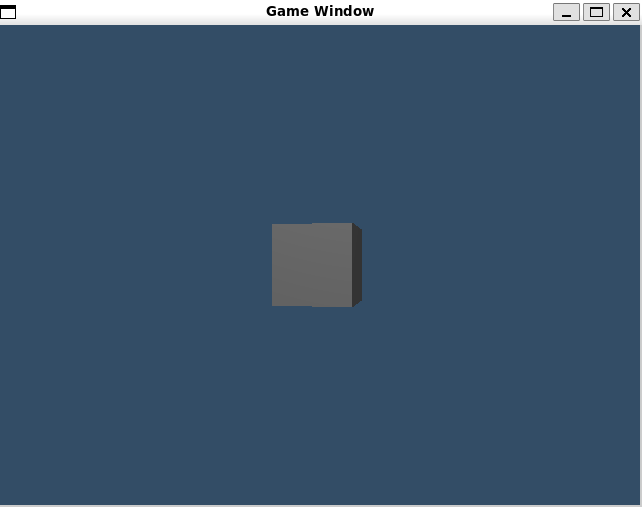

# ⚠️ Lite-Engine is under development and should not be used for production projects yet. ⚠️
for general build instructions, see the makefile located in the same directory as this file.

# Building on WSL2-Ubuntu on Windows 11 (2025)
```
git clone --recursive https://github.com/beholdenspore28/lite-engine.git
cd lite-engine/
sudo apt install make clang
sudo apt-get install libglfw3
sudo apt-get install libglfw3-dev
make
```

you should see a window with a 3d cube spinning in it when make occurs. Hit `ESC` to exit

