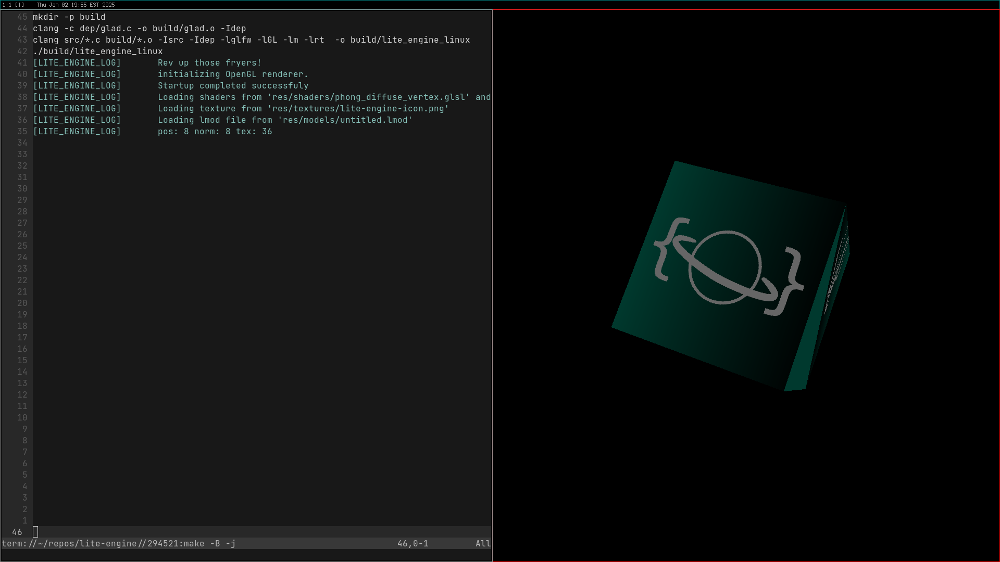

# ⚠️ Lite-Engine is under development and should not be used for production projects yet. ⚠️



# The mission.
I created Lite-Engine with the purpose of providing a light-weight, extendable,
free and open source game engine for anyone and everyone. At the heart of the project
is the notion that anyone should be able to make a game for free with no strings
attached.

The engine is licensed under the MIT license. I chose the MIT license 
because it is extremely permissive. You can do pretty much whatever you want with it.
Please read the provided copy of the MIT license carefuly. It is located in the
LICENSE file

# Features
Lite engine is under development and should not be used for production projects yet.
That being said, here is a (mostly) comprehensive list of its current features.

- Minimal dependencies.
- Simple build system using make
- Verbose and strict naming conventions.
    All functions are named using full english words. No abreviations or shorthand
- Your choice of rendering API. You can choose to use OpenGL, or implement your own.
  Vulkan and DirectX12 APIs are planned for future versions.

# My current goals:
My next big step is skeletal animation.

# Building on Linux
Ensure you have installed GLFW3 using your package manager of choice before you continue.
For example:
```
$ sudo apt install libglfw3 libglfw3-dev
```
To build the demo, open a terminal and navigate to the lite-engine folder.
Run this command to build the engine:
```
$ make -Bj linux
```
# Building on FreeBSD
Ensure you have installed GLFW3 using pkg install before you continue.

To build the demo, open a terminal and navigate to the lite-engine folder.
Run this command to build the engine:
```
$ make -Bj free_bsd
```
# Building on WSL2-Ubuntu on Windows 11 (2025)
```
git clone --recursive https://github.com/beholdenspore28/lite-engine.git
cd lite-engine/
sudo apt install make clang
sudo apt-get install libglfw3
sudo apt-get install libglfw3-dev
make
```
