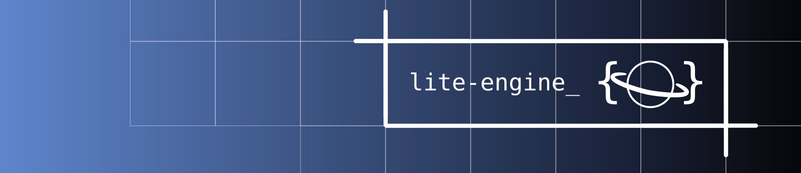
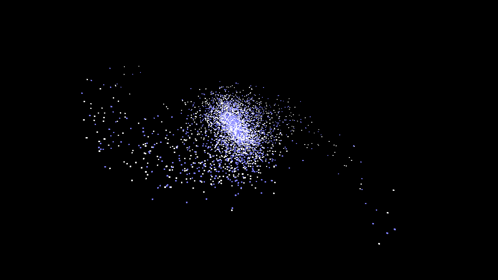

# ⚠️ Lite-Engine is under development and should not be used for production projects yet. ⚠️



# The mission.
I created Lite-Engine with the purpose of providing a light-weight, extendable,
free and open source game engine for anyone and everyone. At the heart of the project
is the notion that anyone should be able to make a game for free with no strings
attached.

The engine is licensed under the MIT license. I chose it because it is extremely
permissive. You can do pretty much whatever you want with it. Please read the
provided copy of the MIT license carefuly. It is located in the LICENSE file

# Please no pull requests if I dont know you personally.

# Features
Lite engine is under development and should not be used for production projects yet.
That being said, here is a (mostly) comprehensive list of its current features.

- Basic 3D renderer using OpenGL 4.6. (It's easy to change the OpenGL version)
- Minimal dependencies. The project only depends on a few libraries, GLFW3, GLAD, 
  blib (my personal general-purpose C lib), and stb_image.h
- Simple build system using make. (uses Mingw on Windows)
- Verbose naming conventions. I have tried to keep the API as clear and explicitly self explanitory
  as possible
- An extreme emphasis on modularity. Lite-Engine is intentionally light-weight to 
  enable easy modification.

# Building on Linux (Most stable)
To build the demo program, open a terminal and navigate to the lite-engine folder.
Run this command to build the engine:
```
make build -B -j4
```

# Building on Windows (Less stable, requires mingw)
Install MinGW and add it to your system's path environment variable. https://www.mingw-w64.org/
To build the demo, open a terminal and navigate to the lite-engine folder.
Run this command to build the engine:
```
make build_windows -B -j4
```
